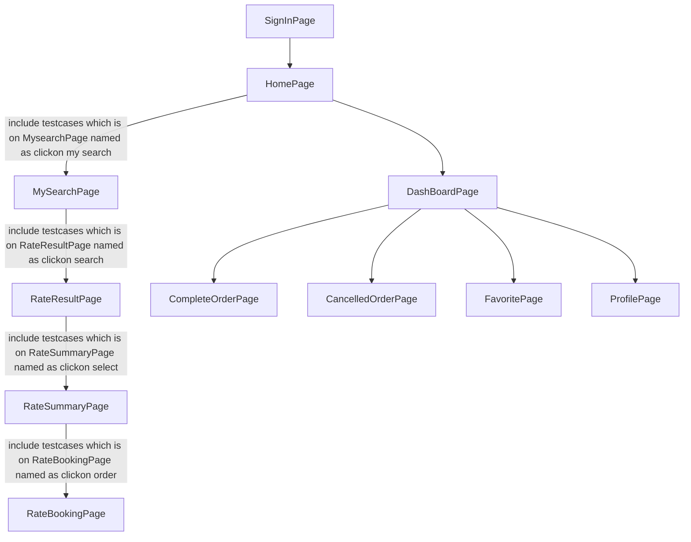

# Standalone

```mermaid
graph TD;
    SignInPage-->HomePage--include testcases which is on MysearchPage named as clickon my search -->MySearchPage--include testcases which is on RateResultPage named as clickon search-->RateResultPage--include testcases which is on RateSummaryPage named as clickon select-->RateSummaryPage--include testcases which is on RateBookingPage named as clickon order-->RateBookingPage;
    HomePage-->DashBoardPage;
    DashBoardPage-->CompleteOrderPage;
    DashBoardPage-->CancelledOrderPage;
    DashBoardPage-->FavoritePage;
    DashBoardPage-->ProfilePage;
    
```

